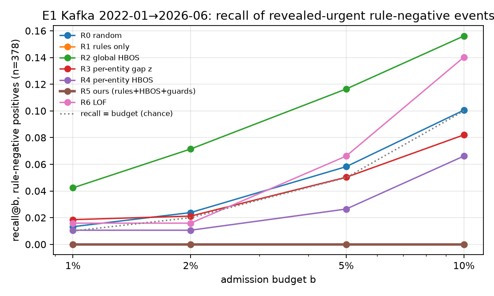
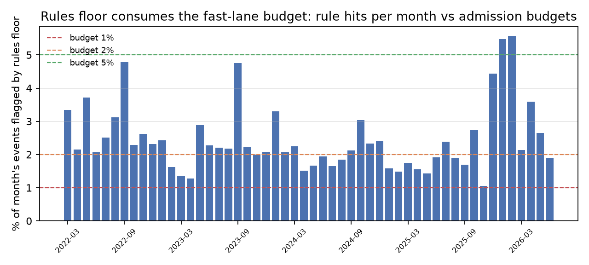

# E1 — Routing under a budget, on the real Apache Kafka corpus

Run `20260905T185046Z-e1-kafka`, primary window 2022-01-01 → 2026-07-01 (pre-registered in
`apps/eval/PREREG.md`, committed at `a5bec2f` before the run started). No LLM anywhere in the
loop; total model cost $0. Artifacts copied to `apps/eval/reports/e1-kafka/`
(`out/` is git-ignored). Written 2026-09-05.

> **Amendment 2026-09-06 — status after independent review.** The review in
> `apps/eval/STATUS/REVIEW-E1-KAFKA.md` reproduces every number below (recall, admissions, the
> R5 − R2 interval to 8 decimals) but finds that **the run cannot stand as thesis evidence
> as-is**: (1) `jira_fix_version_in_flight_later` requires release-state fields that no event
> carries, yet it cast 145,425 confident negative votes (blocker); (2) rule/feature/label text
> comes from export-time snapshots (JIRA summaries/descriptions/comment bodies, PR titles/bodies,
> final components as baseline keys), so timestamp ordering alone does not prove the text was
> known at *t* (blocker); (3) the label model's symmetric negative voting makes urgency a
> conjunction of rare outcomes (0.11 % prevalence) and 0.95 is its accuracy cap, not a measured
> value; (4) the declared-priority rule misses `priority → Critical` transitions and `[VOTE]`
> fires on every reply; (5) affiliation/NAB secondaries use row-index distance over pooled
> streams; (6) the human sanity sample and metric-remediation record are still missing.
> This run is therefore retained as **exploratory / invalid**, exactly as its own gates say. The
> corrections are being registered as dated amendments and a second run will follow; the
> section below is the record of the first run and is left unchanged.

## 0. Run 2 (2026-09-06) — after the review amendments

Run `20260906T072507Z-e1-kafka`, registered in `apps/eval/PREREG-run2.md` (config hash
`c40229de…`, committed before the run). Same replay, window, policies, budgets, primary metric and
label model as run 1; differences: `jira_fix_version_in_flight_later` excluded (abstains without
release fields), `[VOTE]` fires only on thread-starting messages, changelog transitions to
Blocker/Critical count as declared priority. 1 h 51 min, 15.2 GB peak RSS, exit 0.
Artifacts: `apps/eval/reports/e1-kafka-run2/`.

**The amendments worked as intended and the verdict did not move.**

| | run 1 | run 2 |
|---|---:|---:|
| rule hits, share of events | 2.32 % | **1.55 %** (`[VOTE]` 3,965 → 444; declared 501 → 939) |
| months with rules over capacity at b = 2 % | 33 / 52 | **13 / 52** |
| R5 unused slots at b = 2 % | 493 | **2,256** |
| positives (rule-negative) | 378 | **815** (JIRA 698 · GitHub 69 · dev@ 48), 211 clusters |
| R5 rule-negative admissions at 2 % / positives among them | 83 / 0 | 184 / **0** |
| R5 eligible after guards at 2 % / 5 % / 10 % | 255 / 849 / 2,787 | 255 / 849 / 2,788 |

| Primary: recall@2 %, rule-negative (815 positives, 211 entity clusters) | Δ | 95 % CI |
|---|---:|---|
| R5 − R1 | 0.000 | [0.000, 0.000] |
| R5 − R2 | **−0.092** | [−0.115, −0.072] |

Recall@b on rule-negatives, pooled:

| Policy | 1 % | 2 % | 5 % | 10 % |
|---|---:|---:|---:|---:|
| R0 random | 0.004 | 0.010 | 0.042 | 0.083 |
| R1 rules only | 0.000 | 0.000 | 0.000 | 0.000 |
| **R2 global HBOS** | **0.047** | **0.108** | **0.174** | **0.204** |
| R3 per-entity gap z | 0.009 | 0.013 | 0.041 | 0.077 |
| R4 per-entity HBOS, no guards | 0.003 | 0.003 | 0.023 | 0.042 |
| **R5 ours** | **0.000** | **0.000** | **0.000** | **0.001** |
| R6 LOF | 0.013 | 0.015 | 0.064 | 0.145 |

With the budget no longer binding (2,256 free slots at 2 %, 29,955 at 10 %), the guards are the
whole story: 255 of 381,408 rule-negative events are ever eligible at 2 %, and one of 2,788
admitted events at 10 % is a positive. Calibration is now clearly **inverted**: pooled urgency
rate by R5 score decile falls from 0.38 % (lowest decile) to 0.12 % (highest); median monthly
Spearman ρ = −0.53. Per source at 2 %: R2 0.123 on JIRA; R3 0.224 and R6 0.083 on dev@; nothing
above random on GitHub; R5 0.000 everywhere. Gates: same required failures as run 1 minus
nothing (rule-floor feasibility still fails in 13 months; human sanity sample and remediation
record still missing; phase preflight). `evidence_status = non-evidentiary`.

**Label-fusion sensitivity (post-hoc, `apps/eval/reports/e1-kafka-label-sensitivity/`).** With the
same votes, prevalence would be 0.23 % under the registered model, 0.81 % under strict majority,
3.2 % under "≥ 2 distinct outcome functions", 3.9 % under "≥ half of votes", 18.6 % under "any
outcome function". GitHub has only two outcome functions and is starved under every rule except
"≥ half" (69 vs 11,392 positives). Individual functions fire on 2–23 % of the events they observe.
The registered model is the most conservative choice available; changing it is a research-design
decision to be settled by the human sanity sample (§11), not by which rule makes R5 look better.

Remaining known defects not addressed by run 2 (review findings 2, 5, 7, 8): symmetric negative
voting in the label model; adjacent-bucket confirmation semantics; snapshot-text provenance;
row-index lateness metrics. They are documented, not fixed.

---

## Run 1 (2026-09-05) — record, unchanged

## 1. Verdict

**Claim C1 is not supported on Corpus R at the pre-registered budget.** The rule floor by itself
already flags 2.3 % of Kafka events, so at b ≤ 2 % the mandatory rule admissions exceed the
fast-lane capacity in 33 of 52 evaluation months and the deviation layer never gets a slot:
R5 is identical to R1. On the primary population (rule-negative events) R5's recall@2 % is
exactly 0.000, the same as rules-only, below random (0.024) and below the un-keyed global
HBOS baseline R2 (0.071).

| Primary contrast (recall@2 %, rule-negative, 378 positives, 103 entity clusters) | Δ | 95 % CI |
|---|---:|---|
| R5 − R1 | 0.000 | [0.000, 0.000] |
| R5 − R2 | **−0.071** | [−0.103, −0.047] |

At larger budgets the budget stops being the constraint and the guards become it: at b = 10 %
R5 left 26,969 of its slots unused, only 0.74 % of rule-negative events ever passed the
absolute-volume floor plus multi-window confirmation, and none of the 2,787 admitted events
was a revealed-urgent positive. The scorer itself carries little signal on this corpus: the same
per-entity HBOS without guards (R4) is at or below random at every budget, while the global
HBOS (R2) and LOF (R6) are the only policies consistently above chance.

The run is stamped **non-evidentiary** by its own gates (§8); the reasons are the rule-floor
infeasibility itself, the not-yet-done human sanity annotation, and phase-level requirements
(Flink, Corpus S) that are out of scope for this run. The numbers are real and reproducible; the
label is honest about what they cannot yet claim.

## 2. Corpus and run facts

| Item | Value |
|---|---|
| Replay | `kafka-rlong.jsonl`, 629,458 events, SHA-256 `397da1ac…f8a28` |
| Sources | JIRA 235,407 (created 12,670 · transitions 187,253 · comments 35,484); dev@ 63,572; GitHub 330,479 (17,795 PRs: opened 16,628 · merged 12,426 · closed 4,334 · reviews 100,036 · review comments 129,083 · issue comments 55,915 · trunk pushes 12,057) |
| Window evaluated | 2022-01-01 → 2026-07-01 half-open; 387,403 events (JIRA 142,708 · GitHub 210,336 · mail 34,359); first two months tuning-only; 52 evaluation months |
| Rolling protocol | per month *m*: θ and HBOS/robust-z fits on the trailing 12 months < *m*, evaluate on *m* |
| Policies × budgets | R0–R7 × {1, 2, 5, 10} % |
| Wall / memory | 1 h 56 min 33 s; peak RSS 15.3 GB (4 forked policy workers); AMD Ryzen 7 3800X |
| Score log | `scores.parquet`, 12,396,896 rows (event × policy × budget) |
| Prereg hash recorded in results | `8b6e42c1…387a` |

**Amendments to `docs/evaluation-spec.md` recorded in PREREG:** GitHub comes from the GraphQL
API for `apache/kafka` (GH Archive dropped for size); the labelling function
`github_trunk_ci_failure_fix_6h` is excluded because the API stream carries no CI/check events
(coverage would be 0 and fail the ≥ 1 % gate); the 2019-01 → 2026-07 window is registered as a
secondary run (`PREREG-full.md`) and **has not been run yet** — projected peak RSS ≈ 24 GB
exceeded the free memory on the laptop while other applications were open.

Committer roster (website snapshot 2026-09-05) matched 42,246 / 145,425 JIRA, 9,978 / 35,311 mail
and 143,927 / 214,005 GitHub actor slots in the window.

## 3. Revealed-urgency labels

Twelve post-*t* labelling functions fused by the weighted label model. All twelve pass the
pre-registered gates (accuracy ≥ 0.6, coverage ≥ 1 %).

| Function | est. accuracy | coverage | positive votes | negative votes |
|---|---:|---:|---:|---:|
| jira_committer_comment_1h | 0.776 | 0.368 | 32,758 | 112,666 |
| jira_priority_raised_later | 0.950 | 0.368 | 6,325 | 139,100 |
| jira_fix_version_in_flight_later | 0.950 | 0.368 | 0 | 145,425 |
| jira_resolved_24h | 0.867 | 0.368 | 19,400 | 125,989 |
| jira_linked_pr_24h | 0.918 | 0.368 | 12,058 | 133,331 |
| declared_blocker_critical (declared) | 0.947 | 0.368 | 7,937 | 137,488 |
| dev_committer_reply_1h | 0.932 | 0.089 | 2,451 | 32,860 |
| dev_three_responders_2h | 0.950 | 0.089 | 545 | 34,765 |
| dev_vote_cancelled_recast_later | 0.950 | 0.089 | 7 | 35,304 |
| dev_cve_blocker_later | 0.927 | 0.089 | 2,620 | 32,691 |
| github_reverted_48h | 0.949 | 0.541 | 11,009 | 202,629 |
| github_hotfix_reference_24h | 0.950 | 0.542 | 452 | 213,367 |

Declared-priority vs outcome-function agreement: **0.643** (the thesis's own measurement of
label noise in the "declared urgent" signal).

**Resulting prevalence is very low.** Only 421 of 387,403 events (0.109 %) have posterior
p(urgent) > 0.5; 378 of them are rule-negative (JIRA 267, GitHub 69, mail 42). The posterior is
near-bimodal: the 99.9th percentile is 0.52, and lowering the threshold to 0.1 adds only 153
events. Every ranking result below is unchanged under thresholds 0.5 / 0.3 / 0.2 / 0.1
(`reports/e1-kafka/recall_at_budget_rule_negative_pooled.csv` and §10). Two observations for the
reviewer: (i) six of twelve accuracies sit exactly at the model's 0.95 clip, and
(ii) `jira_fix_version_in_flight_later` never voted positive. Whether the fused label is too
conservative is the first item in the independent review (§11); the operating-curve comparison
between policies does not depend on it, because all policies are scored against the same label.

## 4. Primary result: recall@budget on rule-negative events

Pooled over the 52 evaluation months (378 positives). Chance level = the budget itself.

| Policy | 1 % | 2 % | 5 % | 10 % |
|---|---:|---:|---:|---:|
| R0 random | 0.013 | 0.024 | 0.058 | 0.101 |
| R1 rules only | 0.000 | 0.000 | 0.000 | 0.000 |
| **R2 global HBOS** | **0.042** | **0.071** | **0.116** | **0.156** |
| R3 per-entity gap robust-z (production classifier) | 0.019 | 0.021 | 0.050 | 0.082 |
| R4 per-entity HBOS, no guards | 0.011 | 0.011 | 0.026 | 0.066 |
| **R5 rules + per-entity HBOS + guards (ours)** | **0.000** | **0.000** | **0.000** | **0.000** |
| R6 LOF per entity | 0.016 | 0.016 | 0.066 | 0.140 |
| R7 always-fast | 1.000 | 1.000 | 1.000 | 1.000 |

Precision@2 % on rule-negatives: R2 0.32 %, R0 0.10 %, R5 0.00 % — against a prevalence of
0.10 %. Even the best policy admits roughly 300 non-urgent events per urgent one.



## 5. Why R5 admits nothing useful

### 5.1 The rule floor consumes the budget (b ≤ 2 %)

Rule hits in the window: 12,982 events = **2.32 %** of all events (monthly share 1.1–5.6 %,
median 2.2 %). Breakdown: mail `[VOTE]` 3,965; `cve` 2,360; `blocker` word 2,094; declared
Blocker/Critical 501; on-call/pager 62. Rule hits are only 3× more likely to be revealed-urgent
than other events (0.36 % vs 0.12 %).

Because rule admissions are mandatory, months where rule hits exceed b·n leave no capacity:
at 1 % all 52 months are infeasible (5,105 rule hits over capacity), at 2 % 33 of 52 (1,808 over),
at 5 % 2 months, at 10 % none. R5 ≡ R1 wherever the floor is saturated; this is exactly the
pathology the synthetic smoke run showed, now at real scale.



### 5.2 The guards block the deviation layer (b ≥ 5 %)

R5 funnel on the 378,421 rule-negative events:

| Budget | eligible after guards | admitted | positives among admitted | slots left unused |
|---|---:|---:|---:|---:|
| 1 % | 117 | 0 | — | 0 |
| 2 % | 255 | 83 | 0 | 493 |
| 5 % | 849 | 822 | 0 | 9,625 |
| 10 % | 2,787 | 2,787 | 0 | 26,969 |

Eligibility rate by source at 10 %: GitHub 1.16 %, mail 0.92 %, JIRA 0.06 %. The absolute-volume
floor (≥ 3 events in the entity's 5-minute bucket) is not the only cut — in 2024-06, 33 % of
events sat in buckets with ≥ 3 events — so the multi-window confirmation and the trailing-month
θ are doing most of the filtering. The admitted set skews to GitHub review bursts (2,435 of
2,787 at 10 %), which the labels do not consider urgent.

### 5.3 The per-entity scorer has little signal here

R4 (identical HBOS features, per-entity baselines, no guards, full budget) is at or below random
at every budget. R2 (same features, one global baseline) is 1.5–3× random. Per-entity keying —
the design's central bet — hurts rather than helps on Kafka's long-lived `contributor` /
`component` keys, whose 5-minute-bucket density is tiny (median 1 event per occupied bucket).
The production classifier (R3, gap-only robust-z) is indistinguishable from random.

## 6. Per-source recall@2 % (rule-negative)

| Source | positives | R0 | R2 | R3 | R5 | R6 |
|---|---:|---:|---:|---:|---:|---:|
| JIRA | 267 | 0.017 | 0.118 | 0.000 | 0.000 | 0.000 |
| GitHub | 69 | 0.006 | 0.000 | 0.006 | 0.000 | 0.000 |
| dev@ | 42 | 0.006 | 0.000 | 0.157 | 0.000 | 0.120 |

R2's advantage is entirely JIRA; R3 and R6 have their only signal on mailing-list threads.

## 7. Calibration ("real-world figure") and secondary metrics

Revealed-urgency rate by R5 score decile, pooled: 0.16 %, 0.14 %, 0.16 %, 0.17 %, 0.11 %,
0.11 %, 0.10 %, 0.10 %, 0.09 %, 0.09 % (decile 1 = lowest score). The curve is flat-to-inverted;
median monthly Spearman ρ(decile, rate) = 0.03; median lift over rules = 0.004. Higher R5
scores do not mean more urgency on this corpus.

Threshold-free secondaries at b = 2 %, full population (random floor in brackets): VUS-PR
R5 0.0055, R6 0.0060, R2 0.0044 [R0 0.0030]; NAB low-FN R5 −7.08, R1 −7.04 [R0 −7.84]. All
within a hair of the random floor; per the spec's rule these metrics are candidates for the
"floor-near-R5 → drop" remediation record (gate `metric_remediation_recorded`, not yet written).
Decision latency is 0 ms for every policy (offline replay, no I/O).

## 8. Validity gates and evidentiary status

Passed (required): prereg chronology; label accuracy and coverage for all 12 functions;
declared/outcome agreement reported; equal total budget across R0–R6; R5 admissions carry both
guards; random precision ≈ prevalence; random VUS ≈ prevalence; always-flag recall = 1 and
precision = prevalence; affiliation reference series.

Failed or not applicable (required):

| Gate | Status | Meaning |
|---|---|---|
| `rule_floor_budget_feasible` | fail (278 month × budget cells) | the rule floor exceeds capacity — this **is** the finding, not a defect of the run |
| `human_sanity_100_two_annotators` | not run | Phase-3 human annotation of 100 top rule-negative admissions |
| `metric_remediation_recorded` | not run | explicit kept/dropped record for metrics near the random floor |
| `corpus_preflight` | fail | requires Flink replication and Corpus S, which are later phases |

Harm check: N/A by design in this profile (no action provider, no S3 store); 7,257 R5
promotions available for pairing once the store exists.

## 9. Robustness

Flipping 10 % of labels: recall@2 % rule-negative R0 0.022, R2 0.021, R3 0.018, R5 0.0001 — all
policies collapse to chance under label noise except that R5 stays at zero, confirming that its
zero is structural (no admissions), not a labelling accident. Onset jitter does not apply
(no injected situations on Corpus R).

## 10. Sensitivity to the label threshold

| threshold on p(urgent) | rule-neg positives | R0@2 % | R2@2 % | R5@2 % | R6@10 % |
|---|---:|---:|---:|---:|---:|
| 0.5 (registered) | 378 | 0.024 | 0.071 | 0.000 | 0.140 |
| 0.3 | 379 | 0.024 | 0.071 | 0.000 | 0.140 |
| 0.2 | 519 | 0.023 | 0.062 | 0.000 | 0.133 |
| 0.1 | 527 | 0.023 | 0.061 | 0.000 | 0.135 |

Post-hoc, not pre-registered; reported to show the ordering of policies is not a threshold
artefact.

## 11. What this means and what happens next

1. **For the thesis.** C1 as stated ("budgeted router with rules floor + per-entity deviation +
   guards admits high-cost-of-delay events better than equally budgeted baselines") is falsified
   on Kafka at b = 2 %, and the deviation layer contributes nothing at any budget up to 10 %.
   The honest central statement is: on a real open-source engineering stream, revealed urgency
   is rare (≈ 0.1 %), the rules floor alone over-fills a 2 % budget with mostly non-urgent
   `[VOTE]`/CVE/"blocker" mentions, and per-entity burst anomalies are uncorrelated with what
   humans later treated as urgent. That is a publishable negative result with a clear
   mechanism, and it directly motivates E4/E2 (where the value of the batch lane is tested
   independently of the router).
2. **For the design.** Two changes are implied and should be tested as *new* pre-registered
   policies, not by re-tuning R5 on these months: (a) the rules floor must be budgeted rather
   than mandatory (rank rule hits by a priority order, admit up to a share of b); (b) drop the
   volume floor / multi-window guards on low-density entities, or key baselines on `thread`
   and `issue` where density exists. The production classifier (R3) should not be upgraded to
   R5; R2-style global scoring is the only baseline with signal.
3. **Independent review.** A fresh reviewer agent is auditing the label model (conservative
   posterior, 0.95 accuracy clip), the rule regexes (`cve`, `[VOTE]` per message,
   `blocker`), the guard implementation and the temporal firewall. Its report lands in
   `apps/eval/STATUS/REVIEW-E1-KAFKA.md`; blockers found there will be appended here as dated
   amendments.
4. **Still to do for evidentiary status.** Human sanity sample (100 items, two annotators, κ);
   metric remediation record; the secondary 2019–2026 run (needs ≈ 24 GB free); Flink
   replication; the 10 case studies for feature attribution (the current attribution file is
   empty because no HBOS term fired on a true positive).

## 12. Reproduction

```sh
UV_NO_SYNC=1 uv run python apps/eval/scripts/fetch_kafka_jira_mail.py jira mail parse
GH_TOKEN=$(gh auth token) uv run --package harnext-eval python -m harnext_eval.corpus.github_api \
  --repo apache/kafka --since 2019-01-01 --until 2026-07-01 \
  --raw-dir apps/eval/out/corpus/kafka/raw --output apps/eval/out/corpus/kafka/parsed/github.jsonl
uv run python -m harnext_eval.corpus.build_replay \
  --input apps/eval/out/corpus/kafka/parsed/jira.jsonl --input .../mail.jsonl --input .../github.jsonl \
  --output apps/eval/out/corpus/kafka/replay/kafka-rlong.jsonl
OPENBLAS_NUM_THREADS=1 OMP_NUM_THREADS=1 HARNEXT_E1_WORKERS=4 uv run harnext-eval run \
  --config apps/eval/configs/e1-kafka.yaml --replay apps/eval/out/corpus/kafka/replay/kafka-rlong.jsonl \
  --experiments e1 --window 2022-01-01 2026-07-01 --prereg apps/eval/PREREG.md
```

Artifacts: `reports/e1-kafka/{metrics,label_diagnostics,validity,calibration,robustness}.csv`,
`results.json`, `manifest.json`, `config.yaml`, `fig_*.png`, `rule_floor_breakdown.csv`,
`r5_guard_funnel.csv`, `recall_at_budget_rule_negative_pooled.csv`. The 100 MB `scores.parquet`
stays in `out/` (git-ignored).
